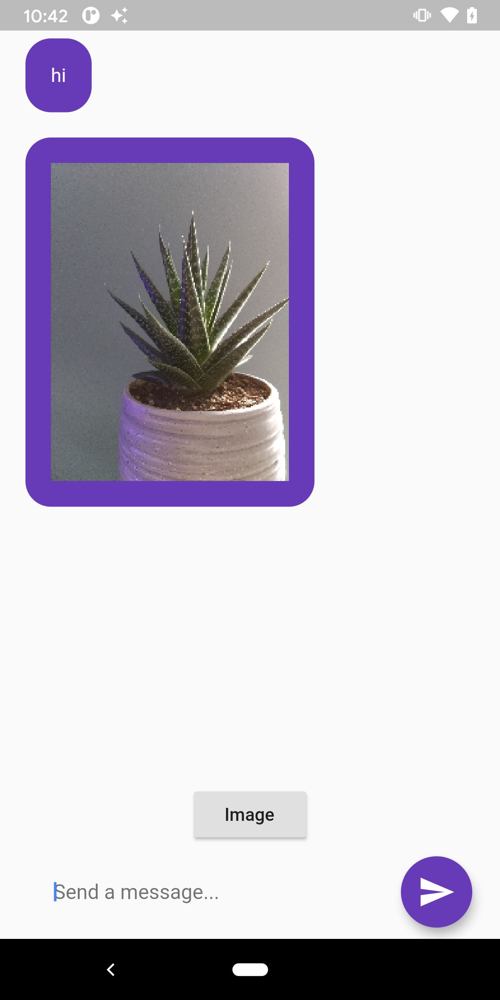

# flutter-web-socket-demo

## Description

This app lets two devices send messages to each other via a NodeJS intermediate Websocket server. This flutter application is inspired by https://medium.com/flutter-community/realtime-chat-app-flutter-node-js-socket-io-e298cd27fb06

This Flutter application add the ability to send a image over web sockets. It leverages the Flutter Image_Picker plugin for ease of use.

## Node Setup Instructions

1. cd into nodejs-ws
2. Run "npm install"
3. then "node index.js"

## Flutter Setup Instructions
1. In flutter project, under flutter_websocket_app_demo
2. change your host ip in MyApp
3. channel: IOWebSocketChannel.connect('ws://192.168.1.XX:3000'),
4. Run device on two device to establish two-way communication.
